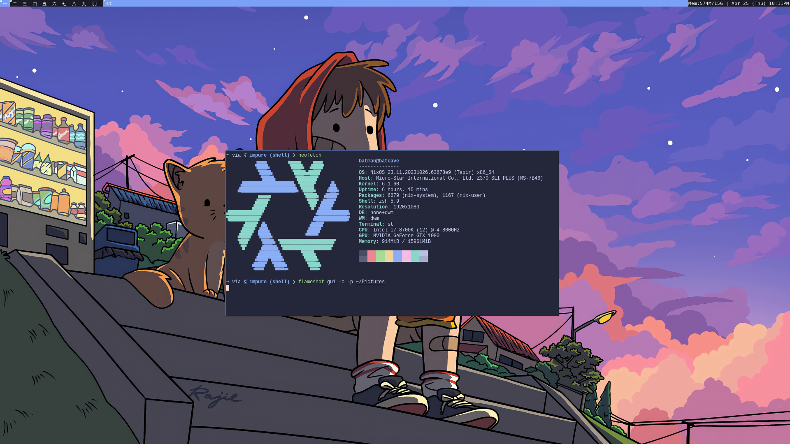

+++
title = 'Dots'
date = 2024-06-01T21:34:28+02:00
draft = false
+++

# Dotfiles

Here is a small overview of the most important parts of my **dots**. Check out the [repo](https://github.com/zenneh/dots) for all the configurations.

## Operating System: NixOS

## Window Manager: DWM

[DWM](https://dwm.suckless.org/) is the _(arguably)_ final stage when going down the hyper-minimal linux road.

Previously I have used [Hyprland](https://hyprland.org/) which is an amazing an customizable window manager. If you like the DWM look but want flexible customization and lot's of plugins, you might want to check out [i3](https://i3wm.org/).

## Terminal: ST

[Simple Terminal](https://st.suckless.org/) is a very minimal terminal and does just enough for me. If you want some extra features or simple additions you can check out the [patches](https://st.suckless.org/patches/). The only patches I use:

- [Anysize](https://st.suckless.org/patches/anysize/)
- [Ligeratures](https://st.suckless.org/patches/ligatures/)

Simple Terminal is created to be minimal. If you want more features, check out these great alternatives:

- [Wezterm](https://github.com/wez/wezterm)
- [Kitty](https://github.com/kovidgoyal/kitty)
- [Alacritty](https://github.com/alacritty/alacritty)

## Editor: Helix

A terminal text editor for the cool kids. [Helix](https://github.com/helix-editor/helix) has a modern approach on the vim keybinding with plenty of built-in features and is programmed in rust :eyes:.

## Browser: Firefox

---

#### Some CLI magic

- [Zoxide](https://github.com/ajeetdsouza/zoxide) is a smarter cd command, inspired by z and autojump.
- [Eza](https://github.com/eza-community/eza), a modern, maintained replacement for ls.
- [Starship](https://starship.rs/)
- [Zathura](https://pwmt.org/projects/zathura)
